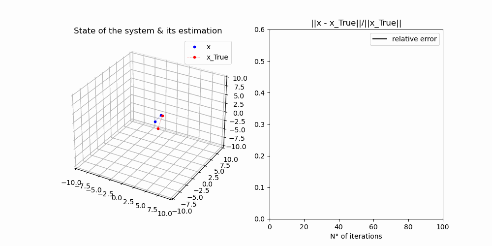

# Kalman Filter

## Description
The kalman filter is a famous estimation technique to build estimators of the state vector $x$. The underlying dynamics and observations schemes are known, but stochastic; perturbed by a gaussian noise with known covariance matrices. Give a look at the [note](note_KF.md) to make yourself a clear idea.

## Installation

Type the following commands in your terminal to install the project locally:
```code
mkdir KF\_dir; cd KF\_dir; git clone git@github.com:roomate/Kalman-Filter.git;
```

## Running the code
You can tune the different configurations parameters via your command line interface with the flags:


## Results

### In 2D
The parameters are:
 
```math
F = \begin{pmatrix}
\cos(\theta) & -\sin(\theta) \\
\sin(\theta) & \cos(\theta)
\end{pmatrix},

H = \begin{pmatrix}
1 & 1 \\
1 & 0 \\
\end{pmatrix},

Q = \begin{pmatrix}
1 & 0.5 \\
0.5 & .4 \\
\end{pmatrix},

R = \begin{pmatrix}
.2 & 0 \\
0 & .4 \\
\end{pmatrix},
``` 
$m\_0 = [1, 0]$, $s = [0, 0]$, and $\theta = \pi/3$.


### In 3D
 
```math
F = \begin{pmatrix}
\cos(\theta)\cos(\phi) & -\sin(\pi/3) & -\cos(\theta)\sin(\phi)\\
\sin(\theta) \cos(\phi) & \cos(\theta) & -\sin^2(\theta) \\
\sin(\phi) & 0 & \cos(\phi)
\end{pmatrix},

H = \begin{pmatrix}
1 & 1 & 0\\
1 & 0 & 1\\
0 & 0 & 1\\
\end{pmatrix},

Q = \begin{pmatrix}
1 & 0.5 & .2\\
0.5 & .4 & 1\\
.2 & .4 & 1\\
\end{pmatrix},

R = \begin{pmatrix}
.4 & 0 & 0\\
0 & .6 & .6\\
0 & .6 & .7\\
\end{pmatrix},
``` 
$m\_0 = [1, 0]$, $s = [0, 0]$, $\theta = \pi/3$ and $\phi = \pi/6$.



